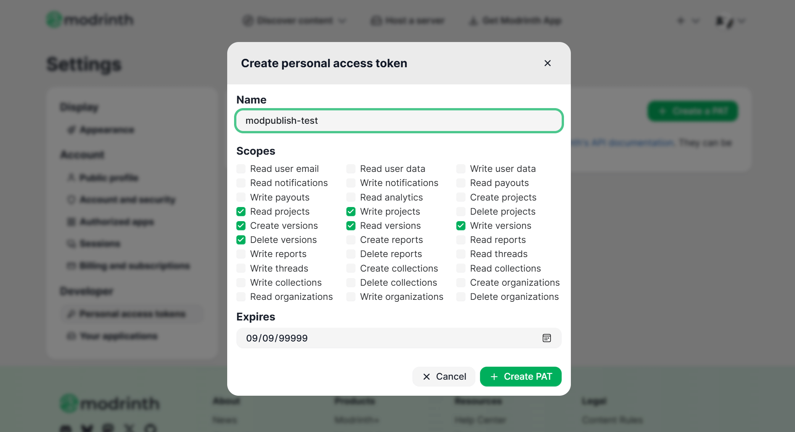
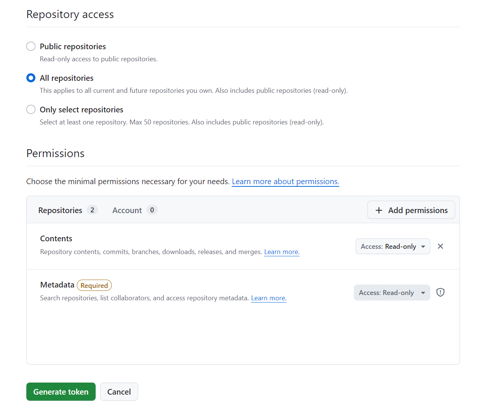

# ModPublish

> ModPublish is currently in the Alpha version with incomplete functionality.

Quickly publish your Minecraft mods to multiple mod hosting sites using Jetbrains IDEA.

It may not be as convenient as some Gradle plugins, but I want to do it.

## Unsupported Features

> These features will never be supported unless someone submits a pull request, 
> or I suddenly want to implement them

- Publishing to custom Git servers
- Publishing to Hangar/SpigotMC
- Publishing plugins/resource packs/data packs

## TODO

> Priority order from top to bottom, smaller numbers indicate higher priority

1. Auto generate title based on mod name/version/loader or user-customized format
2. Upload multiple files simultaneously
3. Code Optimization
4. Publish to GitHub/GitLab
5. Validate Token/ModID/Repo/Branch validity
6. Allow syncing README to Modrinth and CurseForge

## Usage

Before getting started, you need to apply for API Tokens from your publishing targets and configure ModIDs for your
project. If you don't do this, the corresponding publishing targets will be automatically disabled.

### Applying for API Tokens

#### For Modrinth

Apply for an API key from [Pats](https://modrinth.com/settings/pats) and set permissions as shown in the images

After clicking `Create PAT`, click to copy the API Token starting with `mrp_`, save it and fill it into the ModPublish
settings.

#### Curseforge

For Curseforge, you need to apply for two Tokens: **API Token** and **Studio Token**.

Apply for **Studio Token** from [here](https://console.curseforge.com/?#/api-keys)

If the API Token is not displayed after registration, please leave and return to this page after a few minutes. It will
be used for dependency validation.

Apply for **API Token** from [here](https://legacy.curseforge.com/account/api-tokens), they are similar to UUIDs. It
will be used for file uploads and version creation.

#### Github

Please apply from [Fine-grained personal access tokens](https://github.com/settings/personal-access-tokens) and
configure permissions as shown in the image.

Token should start with `github_pat_`.

### Fill in API Tokens and ModID

If you want to use the same API Token across multiple projects, you should fill them in at the following location in
IDEA: `Settings | Tools | ModPublish: Global Settings`

You also need to add ModIDs in `Project | Tools | Configure ModPublish for Project`. The `API Token` you fill in here
will override the global `API Token`.

### About API Token Security

I cannot completely guarantee its security. What you need to do is not share the following information with others:

- The `workspace.xml` file in the project's `.idea` directory
- IDEA's global configuration files
- Any of your API Tokens

Additionally, the API Token will generate an encryption key based on your environment and use this encryption key to
process the API Token, encrypting and decrypting it when needed.
If hardware information, system information and JVM change, the old API Token will immediately become invalid and
unreadable. Therefore, please open settings to back up or generate new API Tokens before making any changes to prevent
operation interruption.

Do not run software from unknown sources, and do not actively calculate encryption keys and share them with others!
If you believe your API Tokens have been leaked, please revoke them immediately and regenerate new ones.

If they support fine-grained permission configuration, please do so and do not add extra permissions.

## Build

Building ModPublish requires the following tools

- JDK 17
- Gradle 9
- Python3

Build steps:

1. Run `./version_processor.py` to download latest Minecraft versions from network
2. Run `./version_processor_curseforge.py` to download Curseforge Minecraft version ID mappings
3. Copy generated json files to `./src/main/resources/META-INF` directory (`minecraft.version.json`)
4. Run `./gradlew buildPlugin`
5. Final output is located in `./build/distributions` directory

## Contribution

Feel free to contribute

## Credits

#### Dependencies

- [Gson](https://github.com/google/gson) - License [Apache 2.0](https://github.com/google/gson/blob/main/LICENSE)
- [JToml](https://github.com/WasabiThumb/jtoml) - License [Apache 2.0](https://github.com/WasabiThumb/jtoml/blob/master/LICENSE.txt)
- [OKHttp](https://github.com/square/okhttp) - License [Apache 2.0](https://github.com/square/okhttp/blob/master/LICENSE.txt)

#### Resource Files
All resource files have been adjusted to display at 24px.

- [Modrinth Logo](https://github.com/modrinth/code/blob/main/packages/assets/branding/logo.svg) - License [GPL-3.0](https://github.com/modrinth/code/blob/main/packages/assets/LICENSE), with proper coloring of the logo
- [CurseForge Logo](https://gist.github.com/thecodewarrior/110057b210551c4ecf2c9be6d58ff824) - License [CC BY 4.0](https://gist.github.com/thecodewarrior/110057b210551c4ecf2c9be6d58ff824?permalink_comment_id=3683512#gistcomment-3683512)
- [Gitlab Logo (vscode-icons)](https://github.com/vscode-icons/vscode-icons) - [License](https://github.com/vscode-icons/vscode-icons#license)
- [Github Icon](https://github.com/logos)

## License
The source code is licensed under the LGPL-3.0 license.